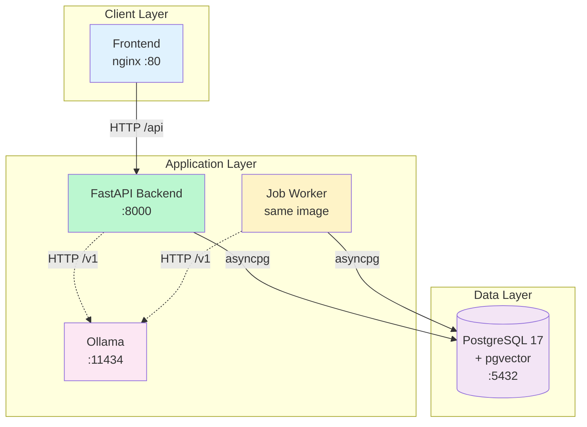
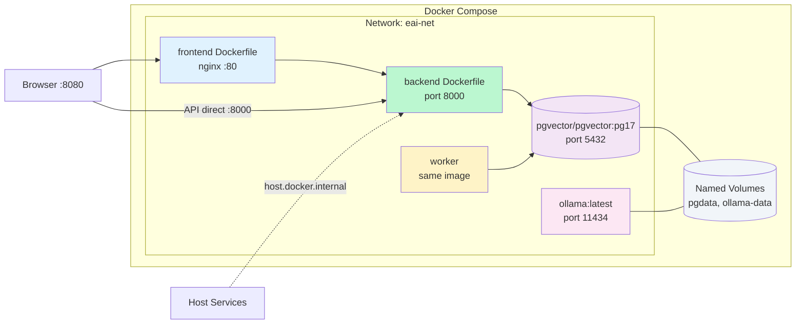
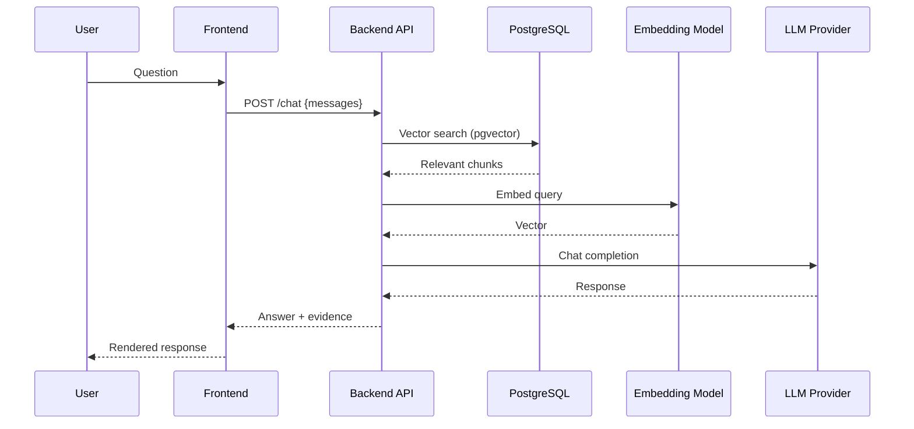
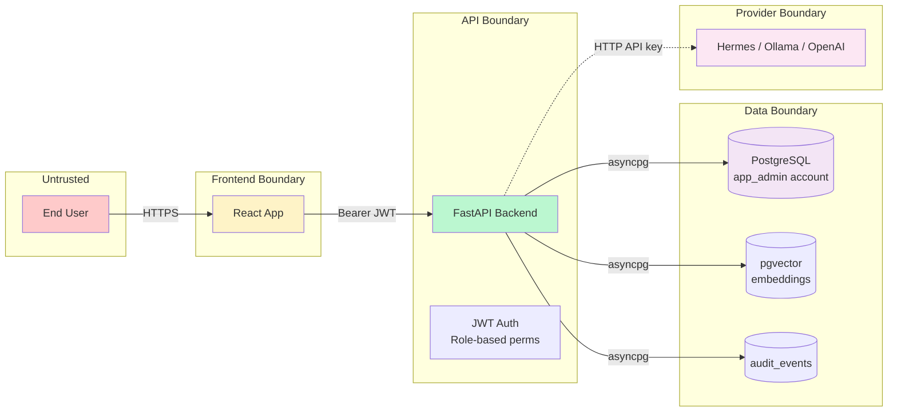

# Enterprise AI & RAG Platform MVP

A portable Enterprise AI and RAG platform with a modular FastAPI backend, PostgreSQL-backed background jobs, CPU-only embeddings, and a React + Vite frontend.

## Quick Start

```bash
# 1. Clone and enter the project
git clone <repo-url>
cd enterprise-ai-platform

# 2. Create .env from template
cp compose/.env.example compose/.env

# 3. Start all services
docker compose -f compose/docker-compose.yml up -d

# 4. Initialize database (first run only)
docker compose -f compose/docker-compose.yml exec api \
  python init_db.py

# 5. Bootstrap the first admin
# Get a bootstrap token
curl -s http://localhost:8000/api/v1/bootstrap/token
# Create admin (replace TOKEN with the token above)
curl -s -X POST http://localhost:8000/api/v1/bootstrap/admin \
  -H "Content-Type: application/json" \
  -d '{"token":"TOKEN","email":"admin@enterprise-ai.com","password":"AdminPass123!","full_name":"Admin"}'

# 6. Access the platform
# API: http://localhost:8000
# Frontend: http://localhost:80
# API docs: http://localhost:8000/docs
```

## Development

```bash
# Start PostgreSQL (development — direct binary, no Docker)
# See BUILD_STATUS.md in backend/ for local dev setup

# Backend
cd backend
source .venv/bin/activate
python init_db.py          # Initialize DB
python -m uvicorn app.main:app --reload --port 8000

# Worker (separate terminal)
python -m app.jobs.runner --poll-interval 2 --verbose

# Frontend
cd frontend
pnpm install
pnpm dev
# → http://localhost:5173
```

## Services

| Service | Port | Description |
|---|---|---|
| `postgres` | 5432 | PostgreSQL 17 + pgvector |
| `api` | 8000 | FastAPI backend |
| `worker` | N/A | Background job worker |
| `frontend` | 80 | React + nginx |
| `ollama` | 11434 | Local LLM inference (optional, `--profile inference`) |

## Architecture

### Service Relationships



### Deployment Diagram



### Data Flow — Chat with RAG



### Trust Boundaries



## API Endpoints

### Authentication
| Method | Path | Description |
|---|---|---|
| POST | `/api/v1/auth/login` | Login with email + password |
| POST | `/api/v1/auth/refresh` | Refresh access token |
| POST | `/api/v1/auth/logout` | Revoke refresh token |
| GET | `/api/v1/auth/me` | Get current user + permissions |

### Bootstrap (first-run setup)
| Method | Path | Description |
|---|---|---|
| POST | `/api/v1/bootstrap/token` | Get bootstrap token |
| POST | `/api/v1/bootstrap/admin` | Create first admin |
| GET | `/api/v1/bootstrap/status` | Check bootstrap status |

### Chat & Conversations
| Method | Path | Description |
|---|---|---|
| POST | `/api/v1/chat` | Chat completion (streaming + non-streaming) |
| GET | `/api/v1/conversations` | List conversations |
| POST | `/api/v1/conversations` | Create conversation |
| GET | `/api/v1/conversations/{id}` | Get conversation + messages |
| DELETE | `/api/v1/conversations/{id}` | Delete conversation |

### Documents (RAG)
| Method | Path | Description |
|---|---|---|
| POST | `/api/v1/documents/upload` | Upload + extract + embed + index |
| POST | `/api/v1/documents/retrieve` | Vector search with MMR |
| GET | `/api/v1/documents/` | List documents |
| GET | `/api/v1/documents/{id}` | Get document details |
| DELETE | `/api/v1/documents/{id}` | Delete document |

### Jobs
| Method | Path | Description |
|---|---|---|
| POST | `/api/v1/jobs/` | Enqueue job (`document_ingest`, `report_generation`) |
| GET | `/api/v1/jobs/` | List all jobs |
| GET | `/api/v1/jobs/{id}` | Get job details + result |
| DELETE | `/api/v1/jobs/{id}` | Cancel/delete job |

### Structured Data
| Method | Path | Description |
|---|---|---|
| POST | `/api/v1/structured-data/query` | Execute read-only SQL (AST-validated) |
| GET | `/api/v1/structured-data/schema` | List available tables |
| POST | `/api/v1/structured-data/query/evidence` | Query as evidence record for grounded chat |

### System
| Method | Path | Description |
|---|---|---|
| GET | `/api/v1/health` | Health check |
| GET | `/api/v1/version` | Version info |

## Configuration

All settings come from environment variables (see `compose/.env.example`):

| Variable | Default | Description |
|---|---|---|
| `APP_ENV` | `development` | `development`, `production`, `test` |
| `POSTGRES_*` | — | Database connection |
| `MASTER_KEY` | dev fallback | Fernet encryption key for credentials |
| `JWT_SECRET_KEY` | dev fallback | JWT signing secret |
| `DEFAULT_PROVIDER` | `hermes` | Model gateway: `hermes`, `ollama`, `openai` |
| `EMBEDDING_MODEL` | `sentence-transformers/all-MiniLM-L6-V2` | Local CPU embedding model (384-dim) |
| `REMOTE_MODEL_ALLOWED` | `false` | Allow remote LLM providers |

**Production note:** All dev fallback secrets MUST be overridden. The default `MASTER_KEY` and `JWT_SECRET_KEY` are not secure.

## Trust Model

- **PostgreSQL account separation**: Application uses `app_admin` (DDL/DML), customer queries execute against read-only accounts
- **Provider keys**: Never exposed to browser; only the API server holds `HERMES_API_KEY`, `OLLAMA_API_KEY`, etc.
- **Audit trail**: All API requests are logged with timestamp, user, action, and outcome
- **JWT auth**: Access tokens expire in 8 hours; refresh tokens in 30 days

## Technology Stack

**Backend:** Python 3.12, FastAPI, SQLAlchemy 2.0 (async), Pydantic v2, PostgreSQL 17 + pgvector, Alembic
**Embeddings:** sentence-transformers, PyTorch CPU
**Frontend:** React 18, Vite, TypeScript, Tailwind CSS
**Infrastructure:** Docker Compose, PostgreSQL (pgvector/pgvector:pg17)
**Local LLM:** Gemma 2b via Hermes provider abstraction

## Environment

Tested on: Ubuntu 24.04 LTS, Python 3.12.3 (venv), no GPU (CPU-only), PostgreSQL 17.11 + pgvector 0.8.1, PyTorch 2.14.0+cpu.
